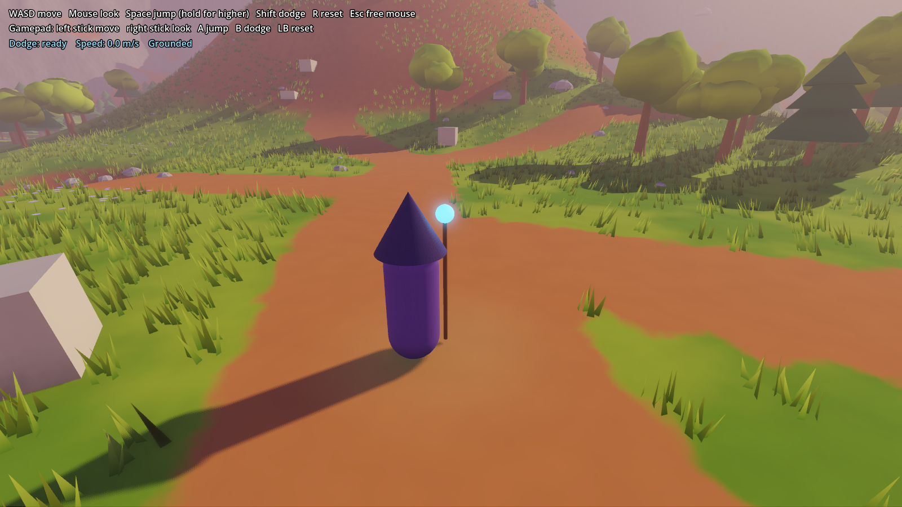
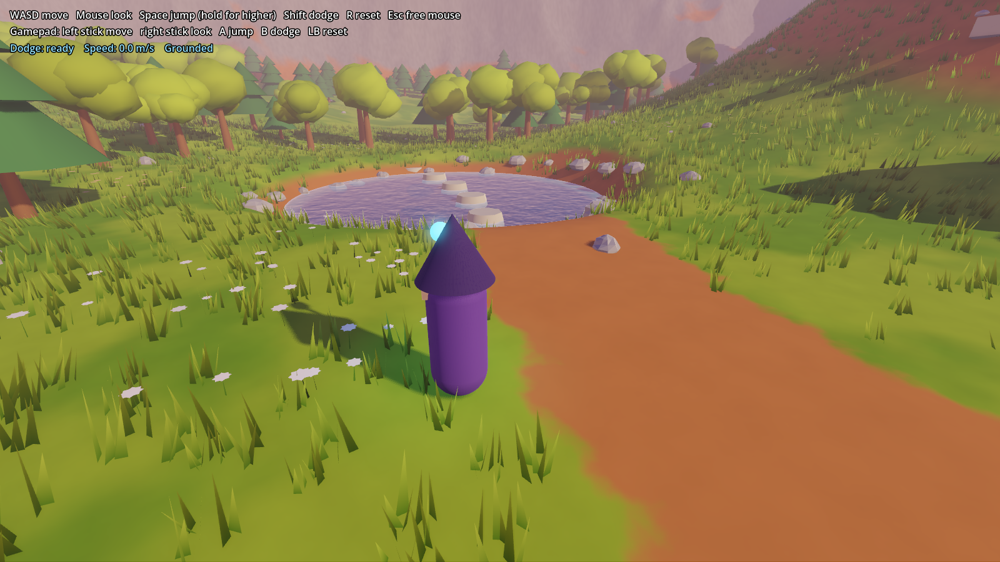
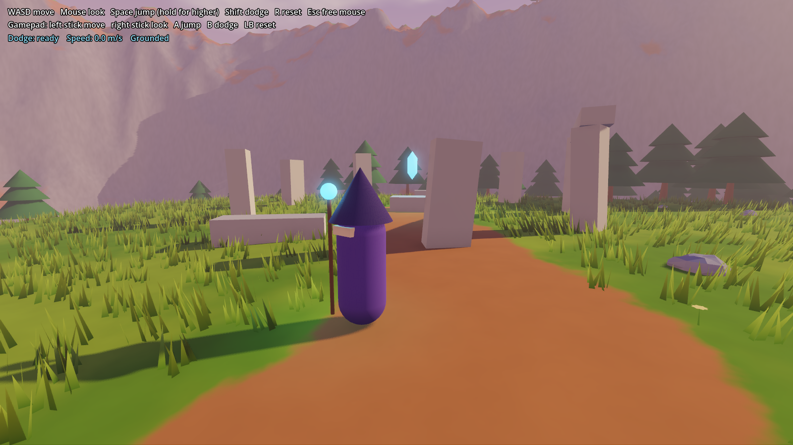

# Arcanist's Dilemma

A third-person action RPG about an arcanist and their journey through magic and life, built in Godot 4.7.



## Current state: the meadow

The main scene (`scenes/world/world.tscn`) is a procedurally generated stylized meadow, built from a fixed seed so it's the same every run:

- **Terrain** (`scenes/world/terrain.gd`): rolling hills, a central hill with a flat top, a pond bowl, dirt trails and a ring of mountains that keeps the player in bounds. Grass, dirt, banks and rock are shaded by `materials/terrain.gdshader`.
- **Vegetation** (`scenes/world/vegetation.gd`): about 850 broadleaf and pine trees in forest patches, boulders and pebbles, wind-blown grass in chunks that fade out with distance, and wildflower patches. Meshes come from `scenes/world/mesh_factory.gd`.
- **Landmarks** (`scenes/world/landmarks.gd`): the pond with stepping stones, a ruined stone circle with a floating crystal on the hilltop, and broken blocks along the trail.
- **Sky** (`materials/sky.gdshader`): dusk gradient, sun glow and drifting clouds, with fog for depth.

| Pond | Hilltop ruins |
| --- | --- |
|  |  |

The terrain, trees and ruins are `@tool` scripts, so they also generate inside the editor. Change the exported values (seed, hill height, tree count and so on) on the Terrain, Vegetation and Landmarks nodes to reshape the world.

## Movement test level

`scenes/greybox_test.tscn` is the original greybox level for tuning movement.

### Greybox areas

| Area | What it tests |
| --- | --- |
| Jump steps (orange) | Blocks from 0.5m to 2.5m tall; 2.5m is out of reach without a jump onto the step before it |
| Gap jumps (blue) | Ramp up to platforms with 2m, 3m and 5m gaps; the last one needs an air dodge |
| Camera pillars (purple) | Spring-arm camera pulling in when geometry blocks it |
| Dodge lane | Narrow corridor with staggered blocks to weave through |
| Low tunnel | Camera behaviour under a ceiling |

### Controls

| Action | Keyboard / mouse | Gamepad |
| --- | --- | --- |
| Move | WASD | Left stick |
| Look | Mouse | Right stick |
| Jump (hold for higher) | Space | A |
| Dodge (one in the air) | Shift | B |
| Reset to spawn | R | LB |
| Free / recapture mouse | Esc / click | |

## Running

Open the folder in the Godot editor and press F5, or from a terminal:

```bash
godot --path .
```

Movement feel is tuned through the exported variables on the `Player` node (`scenes/player/player.tscn`), grouped into Movement, Jump, Dodge and Camera.

## Tests

```bash
godot --headless --path . --script res://tests/smoke_test.gd
```

## Layout

- `scenes/world/` is the meadow and its generators.
- `scenes/greybox_test.tscn` is the movement test level.
- `scenes/player/` holds the arcanist controller and its placeholder model.
- `scenes/levels/greybox.tscn` is the CSG test level.
- `scenes/ui/` is the debug HUD.
- `materials/greybox_grid.gdshader` draws the 1m world-space grid.
