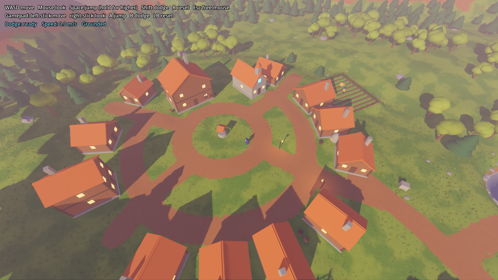
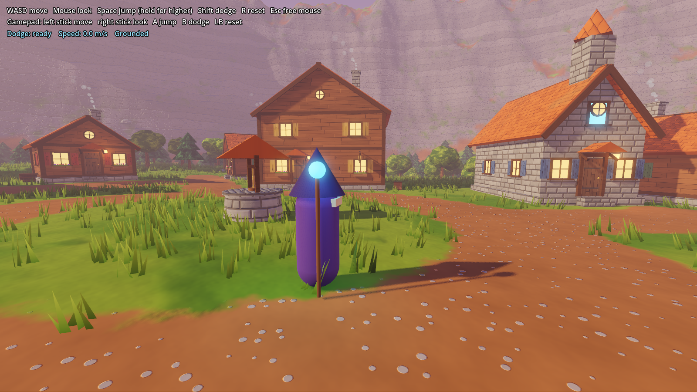
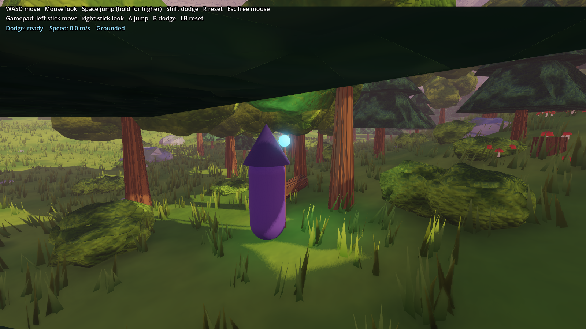

# Arcanist's Dilemma

A third-person action RPG about an arcanist and their journey through magic and life, built in Godot 4.7.


## Playing the prototype

The game boots to the main menu. New Game opens character creation, then drops you on the green in Millbrook. Monsters roam the meadow and the woods (levels 1 to 3) and guard the hilltop ruins (levels 3 to 5, more elites). You start with the three tricks (Spark, Nudge, Jolt); kills give XP, and at level 5 you choose wizard, mage or sorcerer and get that path's starting spells. Dying drops you back at Millbrook after a few seconds.

`scenes/world/game_session.gd` is the only place that knows about every system: it feeds progression into the player's combat stats, swaps spells on the path choice, turns kills into XP and spawns the monsters. Combat, progression, enemies and the UI each have their own folder and README (`systems/combat/`, `systems/progression/`, `actors/enemies/`, `ui/`).

## The meadow

The main scene (`scenes/world/world.tscn`) is a procedurally generated stylized meadow, built from a fixed seed so it's the same every run:

- **Terrain** (`scenes/world/terrain.gd`): rolling hills, a central hill with a flat top, a pond bowl, dirt trails and a ring of mountains that keeps the player in bounds. Grass, dirt, banks and rock are shaded by `materials/terrain.gdshader`.
- **Vegetation** (`scenes/world/vegetation.gd`): about 850 broadleaf and pine trees in forest patches, boulders and pebbles, wind-blown grass in chunks that fade out with distance, and wildflower patches. Meshes come from `scenes/world/mesh_factory.gd`.
- **Landmarks** (`scenes/world/landmarks.gd`): the pond with stepping stones, a ruined stone circle with a floating crystal on the hilltop, and broken blocks along the trail.
- **Sky** (`materials/sky.gdshader`): dusk gradient, sun glow and drifting clouds, with fog for depth.

| Pond | Hilltop ruins |
| --- | --- |
|  |  |

The terrain, trees and ruins are `@tool` scripts, so they also generate inside the editor. Change the exported values (seed, hill height, tree count and so on) on the Terrain, Vegetation and Landmarks nodes to reshape the world.

## Procedural villages

Villages are generated from recipes by a seeded factory: plan as data, validate, retry, then build. Millbrook, the arcanist's home, is generated around the spawn point. See [docs/procgen.md](docs/procgen.md) for how it works and how the same pattern extends to regions, dungeons and monsters.



| Village detail | Woods |
| --- | --- |
|  |  |

Surfaces are textured procedurally in shaders (no image files): plank walls, shingles and fitted stone in `materials/village/`, and terrain, bark, foliage and rock in `materials/`, all sharing the noise and bump-mapping helpers in `materials/include/procedural.gdshaderinc`.

- `systems/procgen/` holds the generation core and the village factory, with recipes in `systems/procgen/village/recipes/`.
- `scenes/procgen/village_lab.tscn` rerolls villages by seed (N/B), recipe (1 to 3) and war damage (W).
- `tests/procgen_test.gd` checks 200 seeds per recipe for valid, repeatable villages.

## Movement test level

`scenes/greybox_test.tscn` is the original greybox level for tuning movement.

### Greybox areas

| Area | What it tests |
| --- | --- |
| Jump steps (orange) | Blocks from 0.5m to 2.5m tall; 2.5m is out of reach without a jump onto the step before it |
| Gap jumps (blue) | Ramp up to platforms with 2m, 3m and 5m gaps; the last one needs an air dodge |
| Camera pillars (purple) | Spring-arm camera pulling in when geometry blocks it |
| Dodge lane | Narrow corridor with staggered blocks to weave through |
| Low tunnel | Camera behaviour under a ceiling |

### Controls

| Action | Keyboard / mouse | Gamepad |
| --- | --- | --- |
| Move | WASD | Left stick |
| Look | Mouse | Right stick |
| Jump (hold for higher) | Space | A |
| Dodge (one in the air) | Shift | B |
| Cast cantrip / main spell | Left / right click | X / Y |
| Cast bar spells | 1 to 6 | |
| Character sheet / talents | C / K | |
| Choose your path (from level 5) | P | |
| Pause | Esc | |
| Reset to spawn | R | LB |
| Grant 500 XP (prototype shortcut) | F8 | |

## Running

Open the folder in the Godot editor and press F5, or from a terminal:

```bash
godot --path .
```

Movement feel is tuned through the exported variables on the `Player` node (`scenes/player/player.tscn`), grouped into Movement, Jump, Dodge and Camera.

## Tests

```bash
godot --headless --path . --script res://tests/smoke_test.gd
```

```bash
godot --headless --path . --script res://tests/procgen_test.gd
```

```bash
godot --headless --path . --fixed-fps 60 --script res://tests/play_session_test.gd
```

Each system also has its own suite under its folder's `tests/`.

## Layout

- `scenes/world/` is the meadow and its generators.
- `scenes/greybox_test.tscn` is the movement test level.
- `scenes/player/` holds the arcanist controller and its placeholder model.
- `scenes/levels/greybox.tscn` is the CSG test level.
- `scenes/ui/` is the debug HUD.
- `materials/greybox_grid.gdshader` draws the 1m world-space grid.
