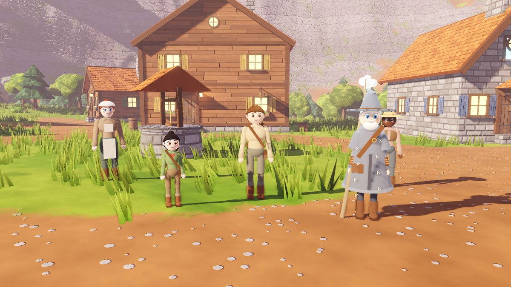
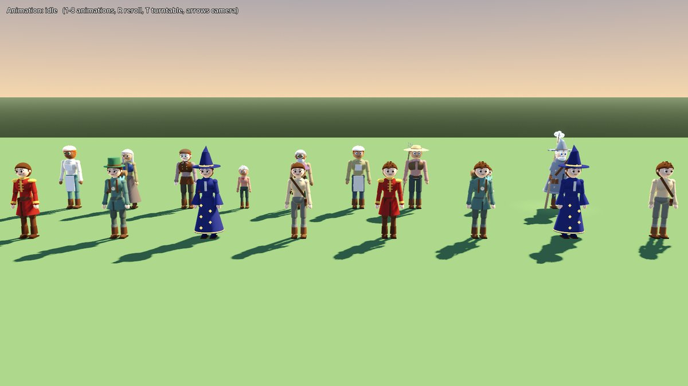
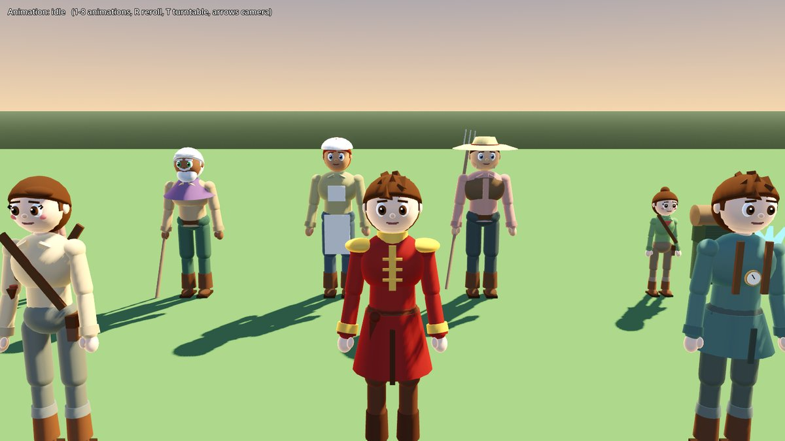
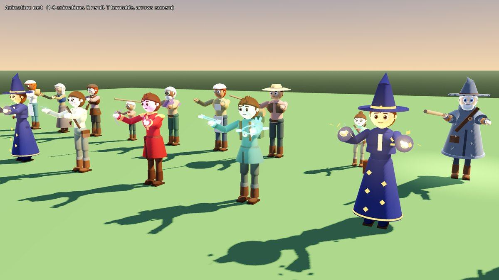
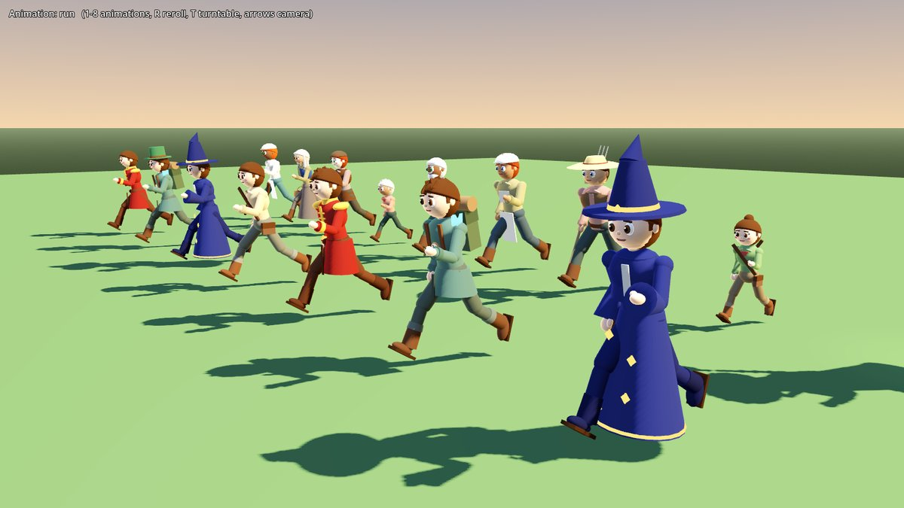
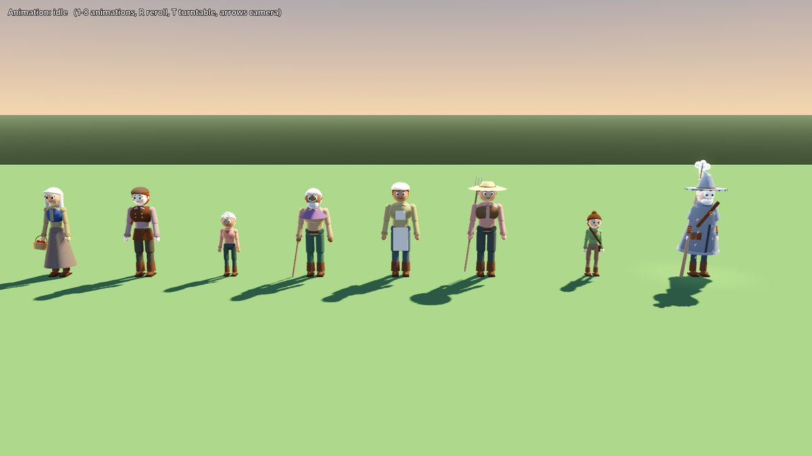

# Characters

The arcanist (boy or girl, with the creation presets), path outfits, animations, and the story's NPCs, all built in code from primitives in the cartoon-realism style of the concept art. Everything lives under `res://actors/characters/`; nothing outside this folder is edited.



| Boy and girl in farm clothes, wizard, mage and sorcerer outfits, villagers behind | Close up |
| --- | --- |
|  |  |

| Casting (wizard runes, mage clock ring and frost, sorcerer lightning) | Running |
| --- | --- |
|  |  |



## Try it

```bash
godot --path . res://actors/characters/preview/character_preview.tscn
```

Keys 1 to 8 play idle, run, jump, fall, dodge, cast, hit and talk on everyone; R rerolls the arcanists' looks and the villagers; T spins them; arrows move the camera.

## Swapping it into the player

For the integrator; these touch `scenes/player/player.tscn`, which this folder doesn't own.

1. In `player.tscn`, delete the children of `Model` (Body, Hat, Face, Staff and its Orb).
2. Instance `res://actors/characters/arcanist.tscn` under `Model`. It builds the player's character from the `Progression` autoload (appearance, then the path's outfit once one is chosen) and rebuilds on a new game, a load, an appearance change or the path choice. Without the autoload it reads `UiSession.character`, then falls back to the default boy.
3. Add a `CharacterAnimationDriver` node (`res://actors/characters/drivers/character_animation_driver.gd`) as a child of `Player`. It needs no setup: it reads the body's velocity and floor contact every physics frame, plays the roll on `dodged` (stretched to `dodge_duration`), the cast on `SpellCaster.cast_started` (cancelled on `cast_interrupted`), and the hit flinch on `HealthComponent.damaged`.
4. Optional: spells can come from the hand instead of the `SpellCaster` node's fixed point with `rig.get_cast_point()` (a `Marker3D` on the right hand).

The player controller keeps working unchanged: it still turns `Model` to face movement and squashes it during a dodge, and the death topple still rotates `Model`. The model is 1.65 to 1.69m tall, stands on y = 0 and faces -Z, so it fits the existing 1.7m capsule. `tests/test_characters.gd` does exactly these steps on the real player in the greybox level.

## Building characters in code

```gdscript
# Any appearance source: a CharacterAppearance, its to_dict(), UiSession.character, or a CharacterSpec.
var rig := CharacterBuilder.build(Progression.appearance)
add_child(rig)
rig.set_path("mage", "chronos")       # change clothes, keep the look
rig.apply_appearance(UiSession.character)

# NPCs
var old_man := CharacterBuilder.build(NpcCatalog.old_man())
var tam := CharacterBuilder.build(NpcCatalog.tam(Progression.appearance))   # shares skin, hair and eyes
var baker := CharacterBuilder.build(NpcCatalog.villager(seed, "baker"))     # same seed, same villager

# Or a ready-made NPC body with collision, in the "npcs" group:
var npc := Npc.create("old_man")
npc.face_toward(player.global_position)
npc.talk()
```

### Animation interface (`CharacterRig`)

| Call | What it does |
| --- | --- |
| `update_locomotion(speed, on_floor, vertical_velocity)` | Each physics frame. Idle below 0.35 m/s, run (playback scaled to speed against `run_speed_reference`), jump while rising, fall while dropping |
| `play_dodge(duration)` | Tucked forward roll, stretched to the duration |
| `play_cast(cast_time)` | Gather then thrust, timed so the release lands at the end of the cast time; `cast_released` fires at that moment and the path's magic shows in the hands |
| `play_hit()` | Flinch and red flash; interrupts a cast |
| `play_talk()` | Dialogue gesture |
| `cancel_action()` | Stops a cast or gesture |
| `set_magic_level(0..1)` | Show magic in the hands, e.g. while aiming |
| `get_cast_point(hand)`, `get_socket(name)` | Hand markers; sockets `item_r`, `item_l`, `cast_r`, `cast_l`, `hat`, `back` for staves, books and gear |

Signals: `action_started`, `action_finished`, `cast_released`, `appearance_applied`.

Cast, hit and talk only drive the upper body, so the legs keep running under a cast. Animations are real `Animation` resources in an `AnimationTree`, keyed on joint paths like `Body/Hips/Spine/Chest:rotation`, so any of them can later be replaced by a hand-made or mocap clip.

## How it's built

| File | What it is |
| --- | --- |
| `core/character_spec.gd` | `CharacterSpec`: the look (presets, outfit, age, height, beard, hat, prop). `from_any()` accepts every appearance format in the project |
| `core/character_style.gd` | `CharacterStyle`: what each preset means in shape and colour, outfit palettes, the toon material |
| `core/character_builder.gd` | `CharacterBuilder`: joints, body, face, hair; merges each joint's parts into one vertex-coloured mesh |
| `core/character_outfits.gd` | `CharacterOutfits`: outfit pieces, hats, props and magic effects |
| `core/character_animations.gd` | `CharacterAnimations`: poses to keyframes, and the blend tree |
| `core/character_rig.gd` | `CharacterRig`: the built model and its animation interface |
| `drivers/character_animation_driver.gd` | `CharacterAnimationDriver`: drives a rig from a `CharacterBody3D` |
| `npcs/npc_catalog.gd` | `NpcCatalog`: the old man, Tam and seeded villagers |
| `npcs/npc.gd` | `Npc`: a standing NPC with collision, turning and talking |
| `arcanist.tscn` | The player's model, following progression |
| `preview/character_preview.tscn` | The preview and screenshot scene |

- **Presets**: ids and order match `data/progression/appearance_presets.json` and `ui/data/ui_character_presets.gd`, so creation indices, saved ids and the model line up (the tests check this). Faces change the skull and jaw; builds change shoulders, waist and limb thickness; the girl body has narrower shoulders, lashes and blush.
- **Outfits**: farm clothes (linen shirt, satchel, rolled trousers, boots; shirt dye linen, blue, green or red), wizard (navy robe with gold rune trim, pointed hat, spellbook), mage (Wayfarer coat, backpack and bedroll, brass clock pendant, frost on the shoulder; the girl gets the green top hat), sorcerer (red coat with gold frogging and epaulettes, sash).
- **NPCs**: the old man is concept take A, the storm-keeper: rune-stitched grey cloak and hood, frayed pointed hat, white beard, copper-wrapped driftwood staff with a crackling storm cloud in its fork. He's named only "the old man in grey" until the Greycloak reveal. Tam is the younger sibling, a child who shares the player's skin, hair colour and eyes and defaults to the other body. Villagers come in seven trades (farmer, baker, elder, child, militia, merchant, miller), each seeded.
- **Cost**: about 20 draw calls per character after merging, and about 20ms to build one.

## Tests

```bash
godot --headless --path . --script res://actors/characters/tests/test_characters.gd
```

176 checks: presets match the creation data, every preset builds for both bodies, proportions fit the player capsule, outfits have their parts, every animation plays and moves the right joints, the arcanist follows progression (appearance changes, path choice, new game), the driver works on the real player (run, jump, dodge, cast, hit), and NPCs are deterministic and turn and talk.
