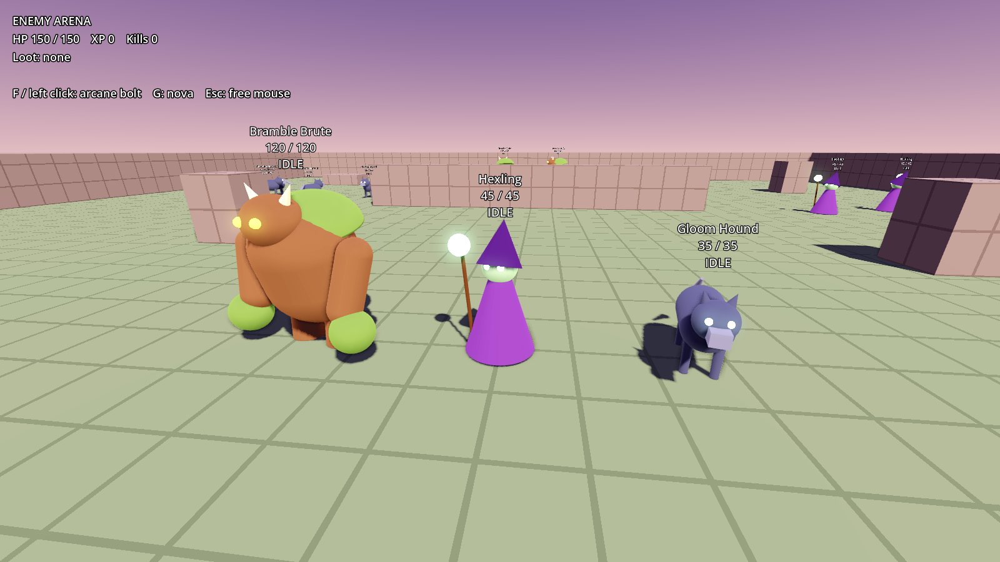
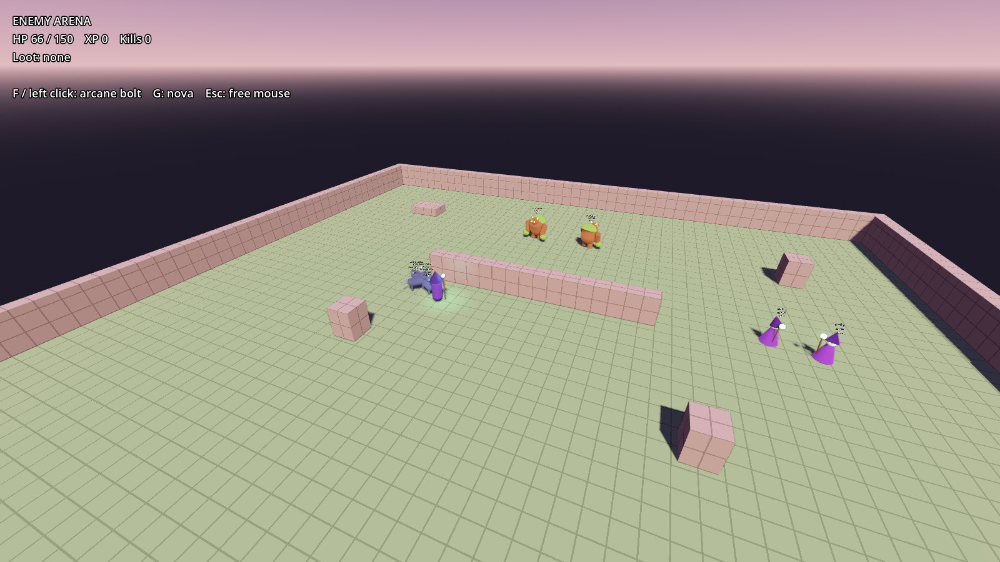

# Enemies

Diablo-style monsters for the prototype: a state-machine AI, three placeholder
monster types, spawners, loot drops and a test arena. Everything lives under
`res://actors/enemies/`; nothing outside this folder is edited.



## Try it

```bash
godot --path . res://actors/enemies/arena/enemy_arena.tscn
```

The arena has a brute camp behind a wall, two hexlings to the east and a hound
pack to the west. The player gets 150 stand-in HP and two debug attacks:
**F / left click** fires an arcane bolt at the enemy you're facing, **G** is a
small nova. Dodging (Shift) through a telegraphed attack or a bolt avoids it.



## Tests

```bash
godot --headless --path . --script res://actors/enemies/tests/test_enemies.gd
```

## Monster types

| Type | Role | HP | Speed | Attack | Special |
| --- | --- | --- | --- | --- | --- |
| Bramble Brute | Melee bruiser | 120 (2 armor) | 3.2 | 18, slow 0.75s windup | Easy to dodge, hurts if it lands |
| Hexling | Ranged caster | 45 | 3.0 | 9, green bolt up to 12m | Backs off when you're within 5m |
| Gloom Hound | Pack animal | 35 | 5.5 | 6, fast bites | Wakes its pack, flees once at 30% HP |

Tuning lives in the `EnemyData` resources next to each scene (`types/*.tres`).

## AI states

`IDLE` (wander near home) → `AGGRO` (short alert pause, wakes the pack) →
`CHASE` → `ATTACK` (telegraphed windup, then the hit) → back to `CHASE`.
`FLEE` triggers once at low health for types that have it. `RETURN` happens when
the player gets past `leash_range` from the enemy's home: it walks back, heals
to full and idles. `DEAD` emits the death events, drops loot and sinks away.

Movement follows a navmesh when the enemy's world has one (the arena bakes one
at startup) and walks straight at its goal otherwise, so enemies also work on
the meadow terrain before it has a navmesh.

## Hooking into other systems

**Kills and XP (progression).** Every `Enemy` emits
`died(enemy, xp_value, loot)`, and each `EnemySpawner` relays it as
`enemy_died`. Without wiring anything, any node in the `enemy_listeners` group
gets `on_enemy_died(enemy, xp_value, loot)` for every kill.

**Loot (inventory/UI).** `loot` is an array of `{"id": StringName, "count": int}`
with gold under `&"gold"` and placeholder item ids (`bramble_thorn`, `hex_dust`,
`arcane_scrap`, `hound_pelt`, `minor_health_potion`). The drop is a glowing gem;
walking over it calls `collect_loot(loot)` on the player if that method exists,
and `on_loot_collected(loot, collector)` on nodes in the `loot_listeners` group.

**Damage (combat).** Enemies follow the combat system's contract: health is a
child node named `HealthComponent`, and damage is
`HealthComponent.take_damage(hit)`. Until `res://systems/combat/` is merged,
each enemy scene uses `core/enemy_health.gd` (`EnemyHealth`) on that node, which
mirrors the parts of the API enemies use. To switch over:

1. In each of `types/*.tscn`, point the `HealthComponent` node's script at the
   combat `HealthComponent` script. `Enemy` sets `max_health`, `armor` and
   `team = &"enemy"` from its data at startup.
2. `EnemyDamage.make_hit()` already builds a combat `Hit` with
   `DamageType.Kind.PHYSICAL` as soon as those global classes exist.
3. Enemies already read `is_stunned()`, `get_move_speed_multiplier()` and
   `knocked_back(impulse)` when the component provides them.
4. The player needs a `HealthComponent` with `team = &"player"`; the arena adds
   a stand-in one at runtime.

Damage from enemies is skipped while the player's `is_invulnerable` is set
(during a dodge).

## Physics layers

| Layer | Used for |
| --- | --- |
| 1 | World and player (unchanged) |
| 3 | Enemy bodies, so the player camera's spring arm ignores them |

Enemy projectiles hit layer 1. The arena's bolt also hits layer 3.

## Layout

- `core/` the shared pieces: `enemy.gd` (AI), `enemy_data.gd`, `enemy_health.gd`,
  `enemy_damage.gd`, `enemy_spawner.gd`, loot table and drop, projectile.
- `types/` one scene and one data resource per monster type.
- `arena/` the test arena.
- `tests/` headless tests.
