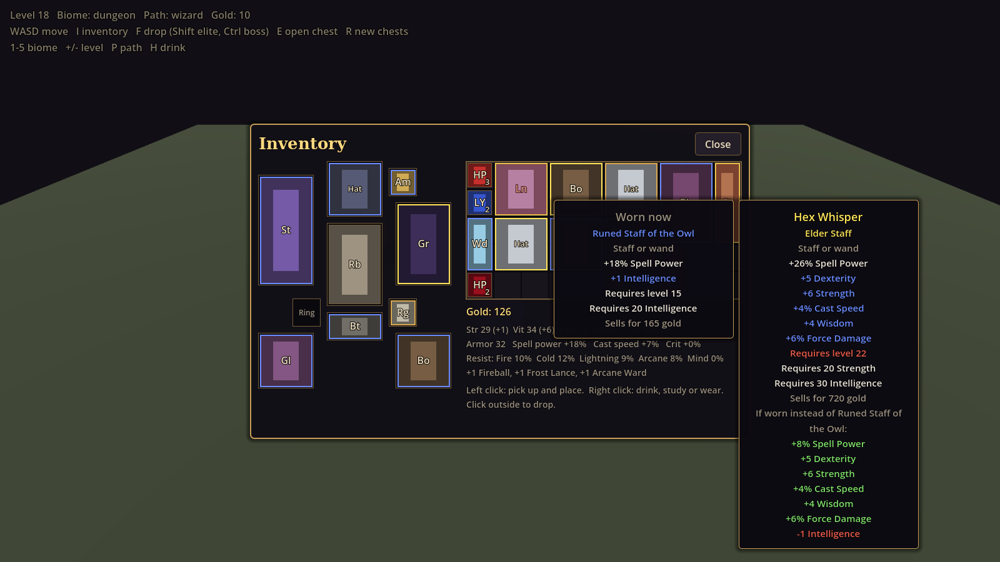
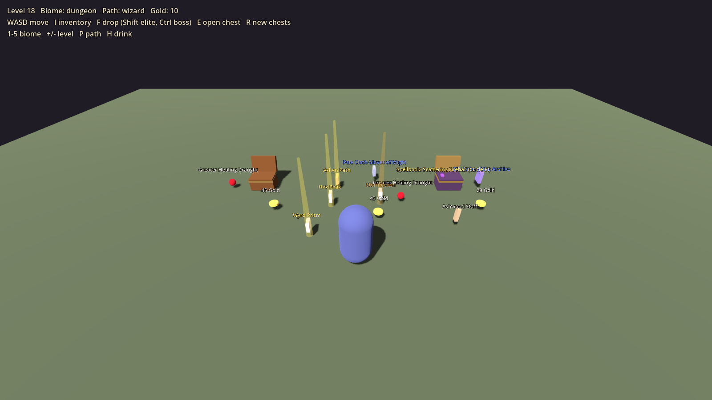

# Items and loot

Diablo 2-style items: gear with rarity tiers and random traits, potions, wizard spellbooks, seeded loot tables keyed by source, biome and level, ten equipment slots that feed combat and progression, a grid inventory, pickups, chests, and save/load with the character. Rules follow the mechanics doc's Gear and loot section; every number lives in `res://data/items/`.





## Try it

- Sandbox: open `res://systems/items/sandbox/items_sandbox.tscn` and press F6. WASD moves, I opens the inventory, F rolls a monster drop (Shift elite, Ctrl boss), E opens a chest, R makes new chests, 1 to 5 switch biome (village, meadow, forest, ruins, dungeon), +/- change level, P cycles the path, H drinks.
- Tests:
  ```bash
  godot --headless --path . --script res://systems/items/tests/test_items.gd
  godot --headless --path . --fixed-fps 60 --script res://systems/items/tests/test_items_in_world.gd
  ```
  The second plays the real world scene with combat, progression and enemies wired in.
- Screenshots: `xvfb-run godot --path . --rendering-driver opengl3 --script res://systems/items/tests/items_screenshots.gd`

## Rules

| Rarity | Color | Random traits |
| --- | --- | --- |
| Common | White | 0 |
| Magic | Blue | 1 or 2 (one prefix, one suffix) |
| Rare | Yellow | 3 to 5 (up to 3 of each), with a two-word name |
| Unique | Gold | Fixed set, from `uniques.json` |

- **Slots:** hat, amulet, robe, staff or wand, path off-hand (grimoire for wizards, lens for mages, focus stone for sorcerers), gloves, belt, boots, two rings.
- **Requirements:** character level (the base's, the unique's, or the highest rolled trait's), Strength for heavy staves and warded robes, Dexterity for wands and light boots, Wisdom for lenses, Intelligence for wizard gear. Gear attributes count toward other gear's requirements, as in Diablo 2.
- **Traits:** 63 prefixes and suffixes in tiers (Apprentice's, Adept's, Magus's, Archon's...), gated by item level and base category. Tiers of one trait share a group, so an item never rolls two. "+N to a spell" rolls on staves, off-hands, amulets and hats, and an off-hand only names its own path's spells.
- **Spellbooks:** a wizard right-clicks one to add its spell to the Library at its circle (`WizardSpellbook.add_book`). The circle rolls up to the highest open at the item level (I at 1, II at 4 ... VII at 19). Variant books (Searing Fireball) drop from Circle III. Other paths can only sell them.
- **Potions:** healing draughts and ley draughts. A ley draught restores mana or arcana, and cools strain for a sorcerer.
- **Loot sources** (`loot.json`): normal monsters (often nothing), elites (2 rolls, better rarity), bosses (4 rolls, 2 gear guaranteed), chests and large chests. Biomes scale the odds (ruins drop more spellbooks, dungeons more gear) and pick the materials. Magic find raises rarity odds with Diablo 2's diminishing returns for rares and uniques.
- **Seeds:** `LootRoller.rng_for(area_seed, index)` makes a generator; the same seed always gives the same loot.

## Files

| File | What it is |
| --- | --- |
| `items_service.gd` | `ItemsService`, the `Items` autoload: the bag, worn gear, pickups, kill drops, stat application, save/load |
| `item_base.gd`, `affix_def.gd`, `unique_def.gd` | Resources for a base, a trait and a unique |
| `item_instance.gd` | `ItemInstance`: one item with its rolls, stats, name, tooltip lines and save dictionary |
| `item_database.gd` | `ItemDatabase`: loads `res://data/items/*.json` (and any item `.tres` there) once |
| `item_generator.gd` | `ItemGenerator`: rolls gear, rarity, potions, spellbooks and uniques |
| `loot_roller.gd` | `LootRoller`: seeded loot tables by source, biome and level; converts the enemies' loot lists |
| `inventory.gd` | `Inventory`: the 10 x 5 grid, stacks and gold |
| `equipment.gd` | `Equipment`: slots, requirement checks, stat and "+N to a spell" totals |
| `item_stats.gd` | `ItemStats`: writes gear into `CombatStats`, `HealthComponent` and the spell source |
| `item_pickup.gd` | `ItemPickup`: an item on the ground with its name in rarity color and a beam for rares |
| `loot_chest.gd` | `LootChest`: a seeded chest for dungeons and the world |
| `../../ui/inventory/` | `InventoryScreen`: paper doll, bag grid, compare tooltips |

| Data | What it tunes |
| --- | --- |
| `bases.json` | 47 bases: staves, wands, hats, robes, gloves, belts, boots, amulet, ring, the three off-hands, potions, spellbook, materials, gold |
| `affixes.json` | Prefixes and suffixes, spell pools for "+N to a spell" and spellbooks, rare name words |
| `uniques.json` | Seven uniques, including Greycloak's Walking Staff (quest only) and The First Spoon |
| `loot.json` | Sources, biomes, rarity odds, gold, spellbook circles, the starter kit |

## Hooking it up

1. Add the autoload after Progression: `Items="*res://systems/items/items_service.gd"`.
2. Optional input actions: `inventory` (I), `interact` (E, opens chests), `drink_potion` (Q). Without them the screen reads the I key and chests read E directly.

That is all the world needs. On its own, `Items`:

- finds the node in the `player` group and its `SpellCaster` and `HealthComponent`, and adds the inventory screen;
- gives a new character the starter kit (oak staff, linen robe, sandals, three healing and two ley draughts, 10 gold) on `Progression.character_loaded`, and restores the bag and gear when a save has them;
- re-applies gear after every `Progression.stats_changed`, one frame later, so it lands after the game session rebuilds stats from attributes;
- re-applies "+N to a spell" whenever the caster's spell source changes (the path choice);
- picks up the enemies' gem drops (it is in `loot_listeners`) and rolls item drops on every kill (it is in `enemy_listeners`).

Other systems:

```gdscript
# Saving: saves the character and the items together
Items.save_game(slot)

# Areas: biome for kill drops
Items.current_biome = &"ruins"

# Dungeons: a seeded chest
var chest := LootChest.new()
chest.loot_seed = hash([dungeon_seed, room_index]); chest.biome = &"dungeon"; chest.level = 6
room.add_child(chest)

# Quests: a reward
Items.pick_up(ItemGenerator.make_unique(&"greycloaks_staff"))
Items.pick_up(ItemGenerator.make_spellbook(&"fireball", 2))

# Vendors and HUD
Items.inventory.gold; Items.gold_changed; Items.sell_item(item); Items.message  # "Your bag is full"
```

`GameSession` still counts gold from the gem drops in its own `gold` field; `Items.inventory.gold` now holds the real purse, so that field can go.
