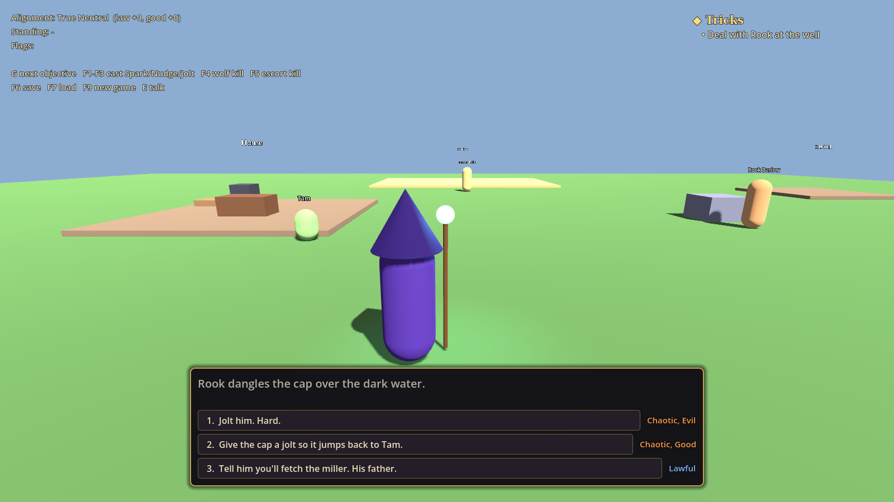
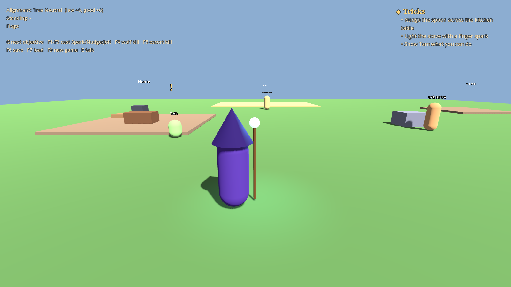
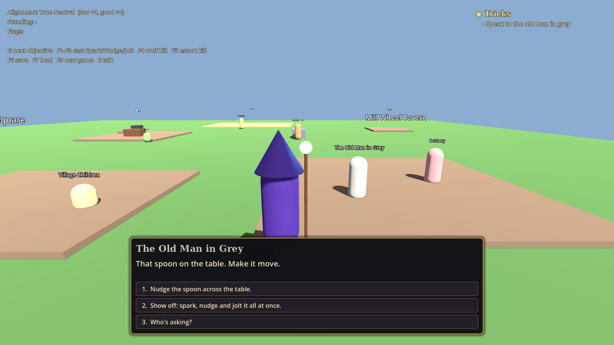

# Quests, dialogue and alignment

Data-driven quests with stages and objectives, branching dialogue with choices, a story-flag store, faction standing, and the arcanist's place on the lawful/chaotic and good/evil grid. Ships with the prologue ("Tricks") and Act I's first key quest, "The Hat and the Warden", from the story doc.



## Try it

```bash
godot --path . res://systems/quests/sandbox/quest_sandbox.tscn
```

A greybox Millbrook with the real player, spells and wolves. Walk up to anyone with a gold "!" and press E. Cast Nudge and Spark inside the kitchen, kill the three wolves that appear in the barley, then follow the tracker. Debug keys: **G** jumps to the next objective, **F1 to F3** count a cast of Spark, Nudge or Jolt, **F4** a wolf kill, **F5** a Warden escort kill, **F6/F7** save and load, **F9** starts over.

| Tracker | The old man |
| --- | --- |
|  |  |

## Tests

```bash
godot --headless --path . --script res://systems/quests/tests/test_quests.gd
```

They validate every quest and dialogue file, then play the whole prologue and all three routes through The Hat and the Warden (hand over, hide and lie, refuse and fight), plus save/load, the Progression hookup and the dialogue box. Screenshots: `xvfb-run godot --path . --rendering-driver opengl3 --script res://systems/quests/tests/quest_screenshots.gd`.

## Files

| File | What it is |
| --- | --- |
| `quest_manager.gd` | `QuestManager`, the `Quests` autoload: runs quests and dialogue, applies effects, saves and loads |
| `quest_database.gd` | Loads `res://data/quests/**/*.json` into resources and checks every reference |
| `story_state.gd` | Flags and faction standing, plus the `Alignment` |
| `alignment.gd` | Two axes from -100 to 100, the nine-cell grid, and the "Lawful, Good" hint text |
| `story_conditions.gd` | Evaluates the condition dictionaries (see its header for the full list) |
| `dialogue_runner.gd` | Steps through one conversation for the dialogue box |
| `quest_progress.gd` | Runtime state of one started quest |
| `data/` | `QuestData`, `QuestStage`, `QuestObjective`, `DialogueData`, `DialogueLine`, `DialogueChoice` resources |
| `world/quest_npc.gd` | `QuestNpc`: makes an NPC talkable, with a prompt and a "!" when it has quest talk |
| `world/quest_area.gd` | `QuestArea`: a named place for reach objectives and "cast here" objectives |
| `sandbox/` | The greybox test scene |
| `res://ui/dialogue/` | `QuestUI` (drop `quest_ui.tscn` in once): `DialogueBox`, `QuestTracker` and notices |

## Writing quests

Everything is JSON under `res://data/quests/`; one file can hold `speakers`, `quests` and `dialogues`. The tests fail on any broken reference, unknown key or missing speaker.

**Quests** have stages; each stage has objectives and moves on when all required ones are done (or any one, with `"complete_when": "any"` for talk-or-stealth-or-combat stages). `branches` pick the next stage by condition; an empty `next` completes the quest.

| Objective type | Target | Counts when |
| --- | --- | --- |
| `talk` | NPC id or dialogue id | that conversation ends |
| `kill` | enemy type (its `EnemyData` file name, e.g. `gloom_hound`) or `any` | an enemy dies |
| `reach` | `QuestArea` id | the player walks in (or is already inside) |
| `collect` | item id | it's picked up after the stage starts |
| `cast` | spell id; `where` limits it to a `QuestArea` | the player casts it |
| `event` | any name | the world calls `notify_event` |
| `flag` | flag id, or `conditions` | it's true |

**Dialogue** lines are an array that flows top to bottom; `next`, `choices`, `branches` and `"end": true` change the flow. The NPC's highest-priority dialogue whose `conditions` pass is the one that plays; `once` plays it a single time. Text can use `{player}` and `{speaker:old_man}`.

**Effects** (on choices, lines, stage entry/completion, quest start/complete/fail): `set`, `clear`, `add` for flags; `alignment` (`{"law": 12, "good": -3}`); `standing` (`{"wardens": 15}`); `give` and `take` items; `xp`; `event` for the world to play; `start_quest`, `goto`, `complete_quest`, `fail_quest`, `complete_objective`; `dialogue` to start a scripted scene. A choice's alignment effects become its hint ("Chaotic, Good") on screen.

**Alignment** follows the design draft: key quests move it by 10 to 15, small choices by 2 to 5, and beyond ±25 on an axis the arcanist leans that way. The old man's speaker name stays "The Old Man in Grey" until the `greycloak_revealed` flag is set, then becomes Ebon Thale.

## Signals

On the `Quests` autoload: `quest_started`, `quest_stage_changed`, `objective_updated`, `quest_completed`, `quest_failed`, `quest_updated`, `flag_changed`, `alignment_changed`, `standing_changed`, `story_event`, `item_granted`, `item_removed`, `xp_rewarded`, `dialogue_started`, `dialogue_ended`, `state_loaded`.

## Hooking it up

- **Autoload:** `Quests="*res://systems/quests/quest_manager.gd"` after `Progression`.
- **UI:** add `res://ui/dialogue/quest_ui.tscn` to the world scene. It pauses the game and frees the mouse during conversations.
- **Spells:** `caster.spell_cast.connect(Quests.on_spell_cast)` on the player's `SpellCaster`.
- **Kills and loot:** nothing to do. `Quests` joins `enemy_listeners` and `loot_listeners`. Enemies that aren't an `EnemyData` type (Hale's escort) get `set_meta(&"quest_type", "warden_escort")`.
- **XP, key quests, names and levels:** read from and sent to the `Progression` autoload when it exists.
- **Save:** `Progression.save_game(slot, {"quests": Quests.to_dict()})`. Loading restores the story from `Progression.loaded_extra` on `character_loaded`, and a new character starts it over.
- **Interact:** an `interact` input action (E) in `project.godot`; until then `QuestNpc` falls back to E.
- **World:** put `QuestNpc` children on the villagers and `QuestArea`s at the places below, and react to `story_event`.

| Prologue and Act I need | Ids |
| --- | --- |
| NPCs | `tam`, `rook`, `farmer_hollis`, `innkeeper`, `old_man`, `warden_sergeant`, `warden_lieutenant`, `children`, plus the props `home_bed` and `old_mill_floorboards` |
| Areas | `kitchen` (spoon and stove), `tavern`, `hill_road`, `village_square` |
| Enemies | three `gloom_hound` in the barley in the `wolves` stage; two `warden_escort` on `warden_escort_attack` |
| Story events | `lightning_strike`, `warden_rider_watches`, `warden_escort_attack`, `wardens_retreat` |
| Items (for the inventory) | `farmhand_gloves`, `old_mans_hat`, `worn_staff` via `item_granted` / `item_removed` |
