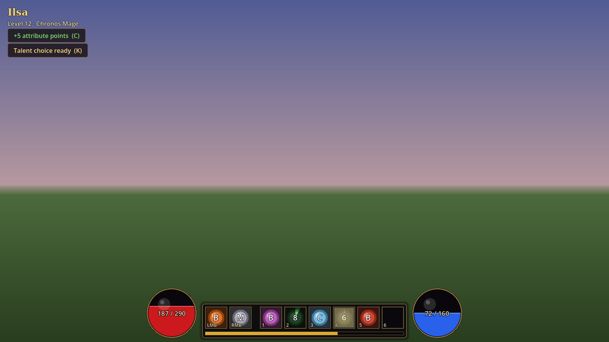

# UI

Everything the player sees on screen: the in-game HUD, character sheet, talent picker, pause menu, main menu and character creation. All of it lives under `res://ui/` and is built in code on one shared theme (`theme/ui_theme.gd`), so colours and fonts change in one place.

| Screen | Scene or class | Opens with |
| --- | --- | --- |
| HUD: health orb, resource orb (mana, arcana or strain), XP bar, 8-slot spell bar with cooldowns, cast bar, level-up banner | `GameHud` (inside `game_ui.tscn`) | Always on |
| Character sheet: attribute allocation with live stat preview, Suggested / Undo / Apply | `CharacterSheet` | C, or the "+N attribute points" button |
| Talent picker: six rows of three, locked by level | `TalentPicker` | K, or the "Talent choice ready" button |
| Pause menu | `PauseMenu` | Esc |
| Main menu | `menus/main_menu.tscn` | Game start |
| Character creation: boy or girl, name, face, skin, hair, hair colour, eyes, build | `menus/character_creation.tscn` | New game |

Any open panel pauses the game and frees the mouse, and Esc closes it before it opens the pause menu.



More screenshots in `ui/docs/`.

## Trying it

```bash
godot --path . res://ui/preview/ui_preview.tscn
```

The preview runs every screen against a mock player. The panel on the right fires the signals the real systems will send (XP, level up, damage, path switch), 1 to 6 and the mouse buttons cast, and the tabs at the top switch to the main menu and character creation.

## Tests

```bash
godot --headless --path . --script res://ui/tests/ui_test.gd
```

Screenshots (needs a display or `xvfb-run`):

```bash
xvfb-run godot --path . --rendering-driver opengl3 --script res://ui/tests/ui_screenshots.gd
```

## Hooking up the game

Add `res://ui/game_ui.tscn` to the game scene once. It finds its data in this order:

1. The three node paths on `GameUI`: `health_source_path`, `caster_source_path`, `progression_source_path`.
2. Otherwise, under the node in the `player` group: the first node with a `health_changed` signal (combat's HealthComponent), and the first with a `spell_cast` signal (combat's SpellCaster).
3. For progression, the first node in the `progression` group, or a node under the player with a `get_stats()` method.
4. Any role still missing is filled by `UiMockPlayer`, so the UI never breaks while the systems are being built. Set `use_mock_when_missing` to false once all three exist.

The UI never imports combat or progression classes. It reads fields by name and only connects the signals a source actually has (`data/ui_bind.gd`), so the real nodes can drop in as they are.

### What the UI reads from combat

Matches the API in `res://systems/combat/`.

| Source | Signals used | Fields and methods used |
| --- | --- | --- |
| HealthComponent | `health_changed(current, maximum)`, `damaged(hit, amount)` | `current_health` / `current` / `health`, `max_health` / `maximum` / `max` for the first frame |
| SpellCaster | `spell_cast(spell)`, `cast_started(spell, cast_time)`, `cast_interrupted()`, `cast_failed(spell, reason)`, `cooldown_started(spell, duration)`, `resource_changed(current, maximum)`, `bar_changed()` | `action_bar` (slot order: left click, right click, 1 to 6), `caster_resource` (a name such as `&"mana"`, or an object with `kind`/`id`), `get_cast_progress()`, `get_cooldown_remaining(spell)` |
| SpellData | | `display_name`, `icon` (Texture2D), `color`, `damage_type`, `cost`, `cast_time`, `cooldown`, `description`; any can be missing |

Without an `icon`, a slot draws a coloured placeholder with the spell's initial.

### What the UI expects from progression

These are the UI's assumptions; adjust either side when progression lands.

- Signals: `xp_gained(...)`, `leveled_up(level, ...)`, `stats_changed(...)`. The arguments do not matter: on any of them the UI calls `get_stats()` and redraws.
- `get_stats() -> Dictionary` with: `name`, `level`, `xp` (into this level), `xp_to_next`, `path` (`arcanist`, `wizard`, `mage`, `sorcerer`), `specialization`, `attributes` (`{&"strength": 10, ...}` keyed by StringName), `unspent_attribute_points`, `unspent_spell_points`, `talent_tree` (`{name, rows: [{level, options: [{name, text}]}]}`), `talent_choices` (row index to option index, -1 for none).
- `allocate_attributes(points: Dictionary) -> bool`, e.g. `{&"intelligence": 3, &"dexterity": 2}`. The sheet stages points and sends them in one call on Apply.
- `choose_talent(row: int, choice: int) -> bool`.

The character sheet previews derived stats (health, resource, spell power, cast speed, crit, resistances, Blink) with the mechanics doc's formulas in `data/ui_stats.gd`. If progression owns different numbers, point the sheet at them or update that file.

### Character creation

The chosen look is stored in `UiSession.character` (no autoload needed): `{name, sex, face, skin, hair, hair_color, eyes, build}`, each an index into `data/ui_character_presets.gd`, where the names and colours live. The player model reads it to apply the look. The portrait on the creation screen is a flat painting until the 3D model can be shown there.

The main menu loads `game_scene` (default `res://scenes/world/world.tscn`) after creation. To boot into it, set `run/main_scene` to `res://ui/menus/main_menu.tscn`.

### Input

Keys are read by physical keycode (C, K, Esc via `ui_cancel`) because `project.godot` belongs to the foundation work. When it is convenient, add `character_sheet` and `talents` input actions there and switch `GameUI._unhandled_input` to them. As long as `GameUI` sits below the player in the scene tree, it handles Esc first, so the player's `release_mouse` action no longer fires while the UI is in the scene; the pause menu frees the mouse instead.

## Layout

- `game_ui.gd` / `.tscn`: the in-game root (CanvasLayer, layer 10) and source discovery.
- `hud/`, `character/`, `progression/`, `menus/`: one screen each.
- `components/`: orb, spell slot and portrait, all custom-drawn.
- `data/`: mock player, stat formulas, talent sample data, look presets, session handoff, binding helpers.
- `theme/`: the shared theme.
- `preview/`: the preview scene. `tests/`: headless tests and the screenshot script. `docs/`: screenshots.
