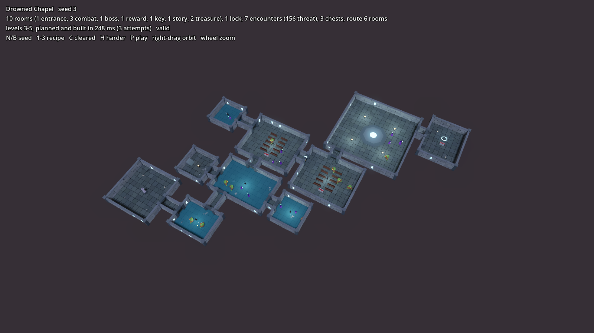
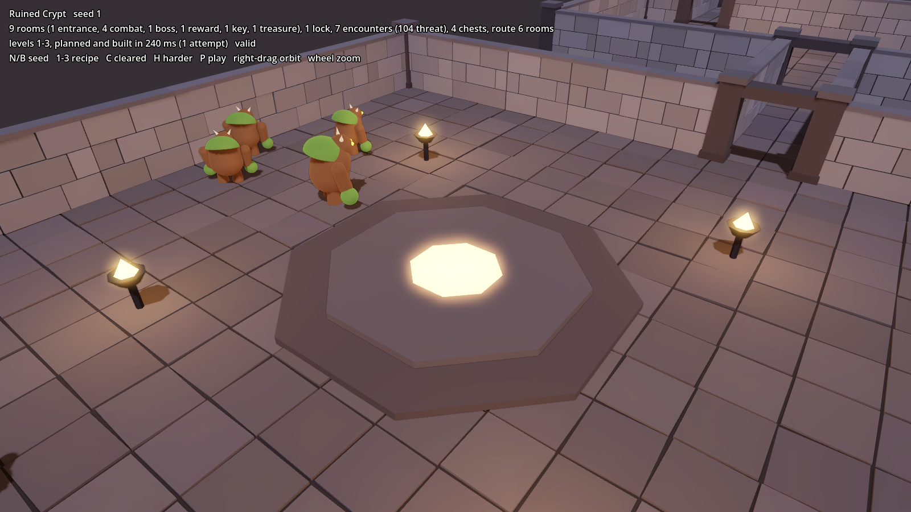
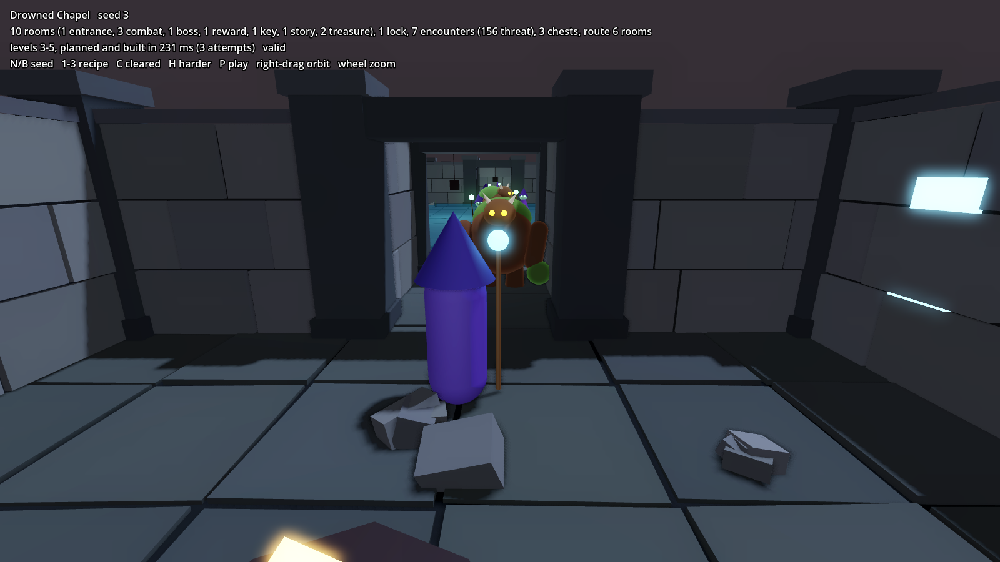

# Dungeons

Procedural dungeons built with the same factory pattern as the villages
(`docs/procgen.md`): a recipe plus a seed is planned as data, validated,
retried with a derived seed if needed, then built. The same seed always gives
the same dungeon, monsters and chests included. Everything lives under
`res://world/dungeons/`; the shared core in `systems/procgen/core/` (`GenRng`)
is used, not copied.



## Try it

Open `world/dungeons/lab/dungeon_lab.tscn` and press F6.

| Key | Does |
| --- | --- |
| N / B | next / previous seed |
| 1, 2, 3 | Ruined Crypt, Drowned Chapel, Ironpeaks Mine |
| C | cleared (same layout, no monsters) |
| H | harder (+2 monster levels, same layout) |
| P | play: drop the arcanist in at the entrance (Esc to come back) |
| Right drag, wheel | orbit, zoom |

## Tests

```bash
godot --headless --path . --script res://world/dungeons/tests/dungeon_test.gd
```

Plans 300 seeds of each recipe and checks every one is valid and repeatable,
that story state never moves a room, that the validator catches deliberately
broken plans, that the enemies spawn tables fill every fighting room within
its budget, and finally plays one dungeon with the real player: lands at the
entrance, picks up the key, opens the locked door, opens a chest.

```
Ruined Crypt     300/300 valid, 30 needed a retry, 300 distinct, 10.6 rooms avg, 3.3 ms per dungeon
Drowned Chapel   300/300 valid, 52 needed a retry, 300 distinct, 10.5 rooms avg, 3.1 ms per dungeon
Ironpeaks Mine   300/300 valid, 72 needed a retry, 300 distinct, 13.9 rooms avg, 6.1 ms per dungeon
```

Building takes 130 to 170 ms per dungeon, plus the navmesh bake.

## Using a dungeon

```gdscript
var dungeon := Dungeon.new()
dungeon.recipe = preload("res://world/dungeons/recipes/drowned_chapel.tres")
dungeon.seed_value = 7
add_child(dungeon)                          # plans, builds, spawns monsters, bakes navigation
player.global_transform = dungeon.player_start()
dungeon.exit_reached.connect(func(which): ...)  # &"exit" behind the boss, &"way_out" up the entrance stairs
```

`Dungeon` signals: `generated(plan)`, `key_collected(key_id)`,
`door_opened(lock_id)`, `chest_opened(chest, loot)`, `boss_defeated`,
`exit_reached(which)`. `dungeon.marker("scribe_ghost")` returns a story
marker for quests (`PlayerStart`, `BossArena` and `Exit` are always there).
Set `level_min`/`level_max` to scale monsters to the player, and `state`
before adding it for story state (`{"cleared": true}`, `{"level_bonus": 2}`).

Chests hand out loot through the enemy-drop contract: `collect_loot(loot)` on
the player if it has it, and `on_loot_collected(loot, collector)` on the
`loot_listeners` group, so the game session already counts chest gold. They
open on touch, or on the `interact` action once the project has one.

## The pipeline

| Step | Script | Output |
| --- | --- | --- |
| Recipe | `DungeonRecipe` (`recipes/*.tres`) | style, levels, route length, side rooms, locks, room templates, threat, chests, story rooms, palette |
| Plan | `DungeonPlanner` | `DungeonPlan`: rooms, corridors, doors, encounters, chests, props as plain data |
| Validate | `DungeonValidator` | list of problems; empty means valid |
| Retry | `DungeonPlanner.plan()` | first valid plan from derived seeds (warns if none) |
| Build | `DungeonBuilder`, `DungeonKit`, `DungeonMeshBatch` | merged meshes, collision, lights, doors, keys, chests, markers |
| Populate | `DungeonPopulator` | one `EnemySpawner` per monster group, from the enemies spawn table |

**Mission graph.** Rewrite rules grow the shape before any geometry: the main
route (entrance, combat rooms, boss, reward), then each lock on the route with
a key branch (sometimes guarded) hanging off a route room between the previous
lock and this one, then story rooms and side rooms (treasure or dead ends).

**Layout.** Each room is placed on a grid next to its parent, joined by a
straight one-cell corridor, never touching another room or running beside
another corridor. Walls go on every cell edge that isn't a doorway, so rooms
only ever connect where the plan says.

**Validation** walks the grid cell by cell through doors rather than trusting
the graph: every room reachable once you pick up the keys you can reach; every
lock really gates what's behind it and its key is on the near side; the reward
room only opens from the boss room; route length within the recipe's bounds;
one boss fight, in the boss room, at least `boss_multiplier` times a room's
threat; every room's threat and monster level inside the recipe's range; no
monsters in the entrance; chest count in range, against walls and clear of
doors; solid props one cell away from every wall (so they never block a door).

**Encounters** are a threat budget per room, about `threat_per_level` times
the monster level, which climbs from `level_min` at the entrance to
`level_max` at the boss. The populator asks the spawn table for groups in the
room's interior and trims them to the budget (a monster costs its level, an
elite three times that). The boss room is led by an elite with a bigger pack.

**Streams.** mission, templates, layout, props, encounters, chests and kit each
draw from their own `GenRng` stream, and story state is applied last, so
clearing or toughening a dungeon never moves a wall.

## Recipes

| Recipe | Style | Levels | Story use |
| --- | --- | --- | --- |
| `ruined_crypt.tres` | Crypt: pillars, sarcophagi, bones | 1-3 | A first dungeon near Millbrook |
| `drowned_chapel.tres` | Chapel: pews, altars, flooded halls, glowing windows | 3-5 | *The Drowned Chapel* (Act I, Fenwood): `scribe_ghost` story room, `spellbook_page` behind the boss |
| `old_mine.tres` | Mine: timber props, crystals, two locks | 8-10 | *Stone That Remembers* (Act II, Ironpeaks): `whispering_statue` story room |

Room templates: hall, pillared, shrine, ossuary, pews, flooded, cavern, dais
(boss). A new dungeon is a new `.tres`; a new look is a new style in
`DungeonKit`.




## What's still rough

- Corridors are straight and rooms form a tree; loops and bends would make
  layouts less predictable.
- No ceilings, so both the overhead and the third-person camera can see in.
- Navigation is baked into the world's default map. Fine for a dungeon scene of
  its own; a dungeon placed inside the meadow would give meadow enemies a
  navmesh only where the dungeon is. Set `bake_navigation = false` there.
- Chest loot uses the enemies' placeholder item ids until the items system
  brings loot tables (`DungeonLoot.roll()` is the one place to swap).
